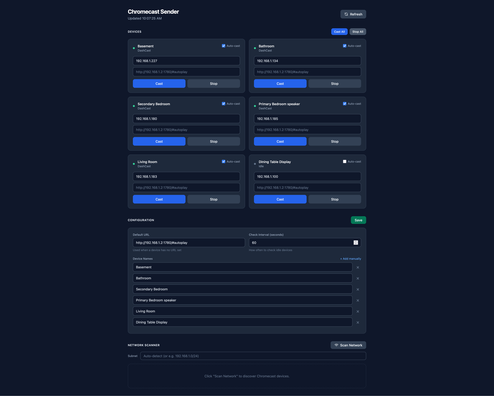

# snapweb-chromecast-sender

Monitors Chromecast devices and automatically casts a web page to them when idle. Useful for always-on dashboards.

## Features

- Auto-cast a URL to idle devices on a configurable interval
- Per-device IP address to bypass mDNS (required in some network environments)
- Network scanner with live progress (mDNS via catt, falls back to TCP probe on port 8008)
- Real device state via pychromecast when a host IP is set
- Web UI to manage devices and config (Alpine.js + Tailwind CSS)

## Usage

```yaml
# docker-compose.yml
services:
  chromecast-sender:
    image: ghcr.io/w-floyd/snapweb-chromecast-sender:main
    ports:
      - "8083:8083"
    volumes:
      - ./config:/config
    environment:
      PORT: "8083"
      CONFIG_PATH: /config/config.json
    restart: unless-stopped
```

```sh
docker compose up -d
# open http://localhost:8083
```

Use **Scan Network** to discover devices, add them to config, set their IP in the host field, then save.

## Config

`config/config.json` is created on first run and editable via the UI.

```json
{
  "check_interval": 60,
  "default_url": "http://192.168.1.x/dashboard",
  "devices": [
    {
      "name": "Living Room",
      "host": "192.168.1.50",
      "url": "",
      "auto_cast": true
    }
  ]
}
```

| Field | Description |
|---|---|
| `check_interval` | Seconds between idle checks (minimum 10) |
| `default_url` | Fallback URL for devices with no URL set |
| `host` | Device IP — required in Docker (bypasses mDNS) |
| `auto_cast` | Cast automatically when the device is idle |

## Environment variables

| Variable | Default | Description |
|---|---|---|
| `PORT` | `8080` | HTTP listen port |
| `CONFIG_PATH` | `/config/config.json` | Config file location |
| `STATIC_DIR` | `/static` | Web UI directory (override to run the binary outside Docker) |
| `STATUS_SCRIPT` | `/usr/local/lib/chromecast/cc_status.py` | pychromecast status helper |

## Notes

- `host` is required when running in Docker with bridge networking — mDNS discovery does not work in that context
- For mDNS scanning to work, deploy on Linux with `network_mode: host` (see commented section in `docker-compose.yml`)
- Auto-cast devices with a `host` set are polled for their real state each interval, so a device that reboots or gets used for something else is re-cast once it returns to idle
- The scanner's subnet field accepts `192.168.1.0/24`, `192.168.1.x`, `192.168.1`, or any address in the subnet
- Subnet auto-detection ignores container bridges and VPN tunnels (`docker0`, `br-*`, `veth*`, `tun*`, …), so a host running Docker scans its LAN rather than every compose network. Set the subnet explicitly if your devices really are behind one of those
- Only one network scan runs at a time; a second request is told to wait rather than doubling the probe load

## Screenshot

